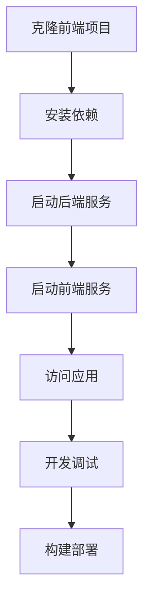

## 前端项目地址

```sh
git clone https://github.com/chengliang4810/jimuqu-admin-ui.git
```

## 环境要求

- **Node.js**: 18.0.0 或更高版本
- **pnpm**: 推荐使用 pnpm 作为包管理器
- **Git**: 用于版本控制

::: warning 注意
请确保已正确安装 Node.js 和 pnpm。可以通过以下命令验证：
```sh
node --version
pnpm --version
```
:::

## 项目结构

```
jimuqu-admin-ui/apps/web-naive/
├── .env.development        # 开发环境配置
├── .env.production         # 生产环境配置
├── vite.config.mts         # Vite 配置
├── package.json            # 项目配置
├── src/                    # 源代码目录
└── public/                 # 静态资源
```

::: danger 注意
你只需要关注 jimuqu-admin-ui/apps/web-naive 的项目目录，其他目录请忽略。

只关注web-naive目录，其他目录请忽略。 

只关注web-naive目录，其他目录请忽略

只关注web-naive目录，其他目录请忽略
:::

## 安装依赖

进入项目目录后，执行以下命令安装依赖：

```sh
pnpm install
```

::: tip 提示
首次安装可能需要几分钟时间，因为需要下载所有依赖包。
:::

## 开发环境启动

### 启动开发服务器

```sh
pnpm run dev:naive
```

启动成功后，前端服务将在以下地址运行：

- **主地址**: http://localhost:5888
- **API 代理**: http://localhost:5888/api

### 开发环境特性

- **热重载**: 代码修改后自动刷新页面
- **代理配置**: 开发环境下 API 请求自动代理到后端
- **类型检查**: 支持 TypeScript 实时类型检查
- **调试工具**: 支持 Vue DevTools 和浏览器开发者工具

## 开发脚本

### 常用命令

```bash
pnpm run dev:naive          # 启动开发服务器
pnpm typecheck              # TypeScript 类型检查
pnpm build:naive           # 生产环境构建
pnpm build:analyze         # 构建分析
pnpm preview               # 预览构建结果
```

### 命令说明

| 命令 | 说明 |
|------|------|
| `dev:naive` | 启动开发服务器，使用 Naive UI 主题 |
| `typecheck` | 执行 TypeScript 类型检查 |
| `build:naive` | 构建生产版本，使用 Naive UI 主题 |
| `build:analyze` | 构建并分析包大小 |
| `preview` | 预览构建后的生产版本 |

## 环境变量配置

### 开发环境配置 (.env.development)

```env
# 端口号
VITE_PORT=5888

# 基础路径
VITE_BASE=/

# API 地址
VITE_GLOB_API_URL=/api

# 是否开启 DevTools
VITE_DEVTOOLS=false

# 是否注入全局 loading
VITE_INJECT_APP_LOADING=true
```

### 生产环境配置 (.env.production)

```env
# 生产环境 API 地址
VITE_GLOB_API_URL=https://api.jimuqu.com

# 其他生产环境特定配置
VITE_DEVTOOLS=false
```

## 核心技术栈

- **Vue 3**: 前端框架
- **Vite**: 构建工具
- **TypeScript**: 类型安全
- **Naive UI**: UI 组件库
- **Vue Router**: 路由管理
- **Pinia**: 状态管理
- **Vxe-Table**: 表格组件

## 开发工作流

### 1. 启动后端服务

确保后端服务已经启动：
- 访问 http://localhost:8080 验证后端服务正常运行

### 2. 启动前端服务

```sh
pnpm run dev:naive
```

### 3. 访问应用

打开浏览器访问：http://localhost:5888

### 4. 开发调试

- 使用浏览器开发者工具进行调试
- 安装 Vue DevTools 扩展程序
- 查看 TypeScript 类型错误：`pnpm typecheck`

## 常见问题

### 1. 端口冲突

如果 5888 端口被占用，可以修改 `.env.development` 中的 `VITE_PORT`：

```env
VITE_PORT=5889
```

### 2. 依赖安装失败

如果依赖安装失败，尝试以下解决方案：

```sh
# 清理缓存
pnpm store prune

# 删除 node_modules 和 pnpm-lock.yaml
rm -rf node_modules pnpm-lock.yaml

# 重新安装
pnpm install
```

### 3. TypeScript 类型错误

运行类型检查查看具体错误：

```sh
pnpm typecheck
```

### 4. API 请求失败

确保后端服务正常运行，并检查以下配置：

- 后端服务地址：http://localhost:8080
- 前端代理配置：`.env.development` 中的 `VITE_GLOB_API_URL`
- 跨域配置：后端是否允许前端域名访问

## 构建部署

### 生产环境构建

```sh
pnpm build:naive
```

构建完成后，生成的文件位于 `dist/` 目录。

### 预览构建结果

```sh
pnpm preview
```

### 构建分析

```sh
pnpm build:analyze
```

此命令会生成构建分析报告，帮助优化包大小。

## 相关链接

- [GitHub 仓库](https://github.com/chengliang4810/jimuqu-admin-ui)
- [Vue 3 文档](https://vuejs.org/)
- [Vite 文档](https://vitejs.dev/)
- [Naive UI 文档](https://www.naiveui.com/)
- [TypeScript 文档](https://www.typescriptlang.org/)

## 流程图

