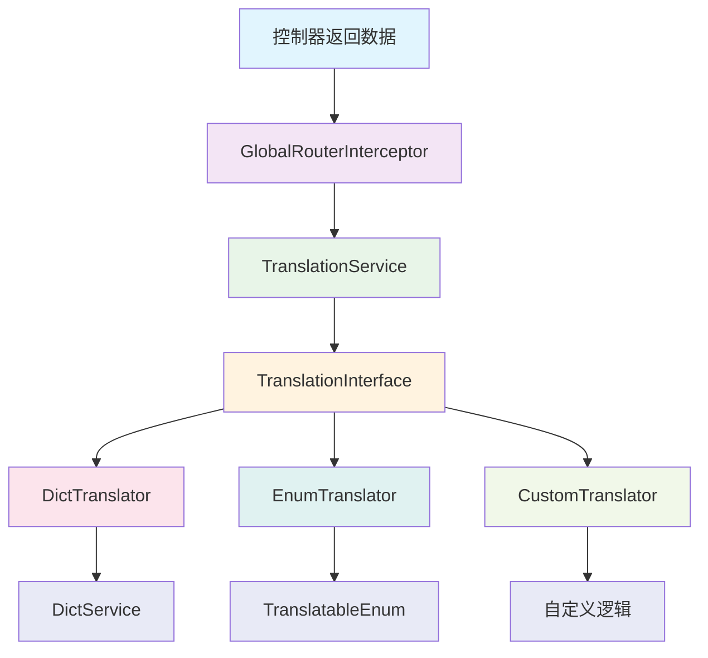

# 翻译模块使用指南

## 概述

`jimuqu-common-translation` 是一个轻量级的翻译模块，支持多种翻译方式：

- **数据库字典翻译**: 基于系统字典表的自动翻译
- **枚举翻译**: 基于枚举类的自动翻译
- **自定义翻译**: 支持自定义翻译逻辑

该模块通过注解方式实现字段值的自动翻译，无需手动转换，提高开发效率。

## 架构设计



## 核心组件

### 1. @Trans 注解

```java
@Documented
@Retention(RetentionPolicy.RUNTIME)
@Target(ElementType.FIELD)
public @interface Trans {
    String value() default "";
    TransType type() default TransType.DEFAULT;
    Class<? extends TranslatableEnum> enumClass() default VoidEnum.class;
    String field() default "";
    String defaultValue() default "";
}
```

**参数说明：**
- `value`: 字典类型或枚举类全名
- `type`: 翻译类型（DICT/ENUM/CUSTOM/DEFAULT）
- `enumClass`: 枚举类（type=ENUM 时使用）
- `field`: 翻译的字段，默认为自身
- `defaultValue`: 默认值

### 2. TranslationService

核心翻译服务，负责：
- 递归处理对象字段
- 支持集合、Map 等复杂类型
- 调用对应的翻译器
- 处理异常和默认值

### 3. GlobalRouterInterceptor

全局拦截器，自动拦截控制器返回的 R 对象，对数据进行翻译处理。

## 使用指南

### 1. 字典翻译

#### 步骤 1：创建字典数据
在系统中配置字典类型和字典数据。

#### 步骤 2：在 VO 类中添加 @Trans 注解
```java
public class SysUserVo {
    private String sex;  // 原始值：0,1,2

    @Trans(type = TransType.DICT, value = "sys_user_sex", field = "sex")
    private String sexLabel;  // 翻译后：男,女,未知
}
```

#### 步骤 3：自动翻译
控制器返回数据时，`sexLabel` 字段会自动被翻译为对应的字典标签。

### 2. 枚举翻译

#### 步骤 1：创建可翻译枚举
```java
@Getter
public enum GenderEnum implements TranslatableEnum<String> {
    UNKNOWN("0", "未知"),
    MAN("1", "男"),
    WOMAN("2", "女");

    private final String value;
    private final String label;

    GenderEnum(String value, String label) {
        this.value = value;
        this.label = label;
    }
}
```

#### 步骤 2：在 VO 类中使用
```java
public class SysUserVo {
    private String sex;  // 原始值：0,1,2

    // 方式 1：直接指定枚举类
    @Trans(type = TransType.ENUM, enumClass = GenderEnum.class, field = "sex")
    private String genderLabel;

    // 方式 2：通过类名字符串（兼容旧版本）
    @Trans(type = TransType.ENUM, value = "com.jimuqu.system.GenderEnum", field = "sex")
    private String genderLabel2;
}
```

### 3. 自定义翻译

#### 步骤 1：继承 CustomTranslator
```java
@Component
public class MyCustomTranslator extends CustomTranslator {
    @Override
    public String translate(Object value, Trans trans) {
        // 实现自定义翻译逻辑
        if ("1".equals(value.toString())) {
            return "活跃";
        } else if ("0".equals(value.toString())) {
            return "非活跃";
        }
        return trans.defaultValue();
    }
}
```

#### 步骤 2：在 VO 类中使用
```java
public class SysUserVo {
    private String status;  // 原始值：0,1

    @Trans(type = TransType.CUSTOM, field = "status", defaultValue = "未知状态")
    private String statusLabel;  // 翻译后：非活跃,活跃,未知状态
}
```

### 4. 复杂对象翻译

翻译模块支持递归处理复杂对象：

```java
public class OrderVo {
    private String status;

    @Trans(type = TransType.DICT, value = "order_status", field = "status")
    private String statusLabel;

    private List<OrderItemVo> items;  // 会递归翻译 items 中的字段
}

public class OrderItemVo {
    private String itemType;

    @Trans(type = TransType.DICT, value = "item_type", field = "itemType")
    private String itemTypeName;
}
```

### 5. 集合和 Map 翻译

```java
// 列表数据自动翻译
public List<SysUserVo> getUserList() {
    List<SysUserVo> users = userService.selectUserList();
    // 返回时自动翻译每个 user 对象中的 @Trans 字段
    return users;
}

// Map 数据自动翻译
public Map<String, Object> getUserData() {
    Map<String, Object> data = new HashMap<>();
    data.put("user", sysUserVo);
    data.put("list", userList);
    // 返回时自动翻译 Map 中的值
    return data;
}
```

## 最佳实践

### 1. 字段命名规范
```java
// 推荐：使用源字段名 + Label/Name 后缀
private String sex;
@Trans(field = "sex", type = TransType.DICT, value = "sys_user_sex")
private String sexLabel;

private String status;
@Trans(field = "status", type = TransType.DICT, value = "sys_user_status")
private String statusName;
```

### 2. 默认值设置
```java
// 为所有翻译字段设置合理的默认值
@Trans(type = TransType.DICT, value = "sys_user_sex", field = "sex", defaultValue = "未知")
private String sexLabel;
```

### 3. 枚举设计
```java
// 枚举值和标签要明确对应
@Getter
public enum UserStatus implements TranslatableEnum<String> {
    ACTIVE("1", "正常"),
    DISABLE("0", "停用"),
    LOCKED("2", "锁定");

    // 实现 TranslatableEnum 接口
    @Override
    public String getValue() { return value; }
    @Override
    public String getLabel() { return label; }
}
```

### 4. 性能优化
- 枚举翻译使用缓存，性能较好
- 字典翻译依赖 DictService，建议配置字典缓存
- 避免在循环中手动调用翻译服务

### 5. 错误处理
- 翻译失败时会返回默认值
- 建议为所有 @Trans 字段设置 defaultValue
- 异常会被捕获并记录日志

## 高级特性

### 1. 递归翻译控制
TranslationService 会自动判断字段类型，跳过基本类型、Java 核心类、数组、枚举等，只处理自定义对象类型。

### 2. 翻译器扩展
可以通过实现 TranslationInterface 接口添加新的翻译器：

```java
@Component
public class ApiTranslator implements TranslationInterface {
    @Override
    public String translate(Object value, Trans trans) {
        // 调用外部 API 进行翻译
        return externalApi.translate(value.toString());
    }
}
```

### 3. 条件翻译
可以在 VO 类中添加条件判断：

```java
public class SysUserVo {
    @Transient
    private boolean enableTranslation;

    @Trans(type = TransType.DICT, value = "sys_user_sex", field = "sex")
    private String sexLabel;

    // 可以在业务逻辑中控制是否启用翻译
}
```

## 注意事项

1. **自动拦截**：只有继承 BaseController 的控制器返回 R 对象时才会自动翻译
2. **字段类型**：@Trans 注解字段类型必须是 String
3. **循环引用**：避免对象间的循环引用，可能导致栈溢出
4. **性能考虑**：大量数据翻译时注意性能影响
5. **空值处理**：源字段为 null 时不会进行翻译

## 故障排除

### 1. 翻译不生效
- 检查是否继承了 BaseController
- 确认返回的是 R 对象且 code 不为失败状态
- 验证 @Trans 注解配置是否正确

### 2. 翻译结果为默认值
- 检查字典数据是否存在
- 验证枚举类是否正确实现 TranslatableEnum 接口
- 确认源字段值是否正确

### 3. 性能问题
- 检查是否配置了字典缓存
- 避免不必要的递归翻译
- 考虑批量查询优化

## 版本历史

- **v1.0.0**: 基础翻译功能
- **v1.1.0**: 支持枚举翻译和自定义翻译
- **v1.2.0**: 优化递归处理和错误处理
- **v1.3.0**: 添加翻译器扩展机制

---

*该指南基于 jimuqu-admin 项目中的翻译模块实现，如有更新请参考最新代码。*