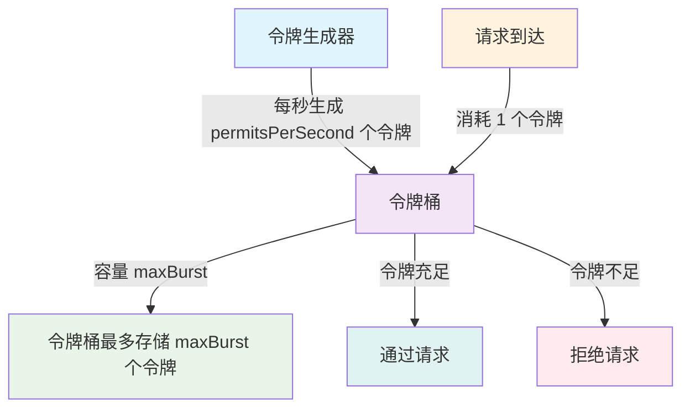
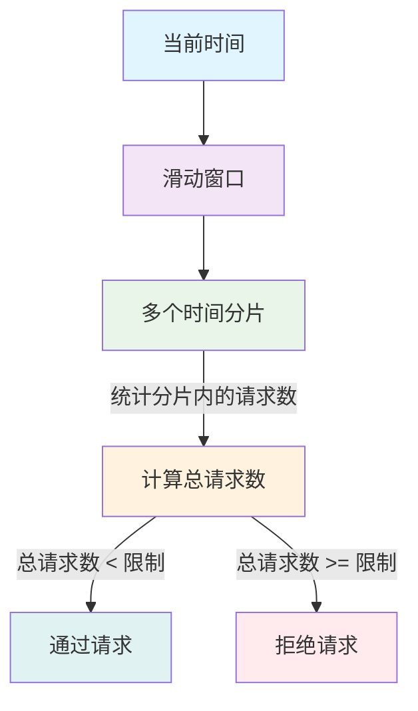
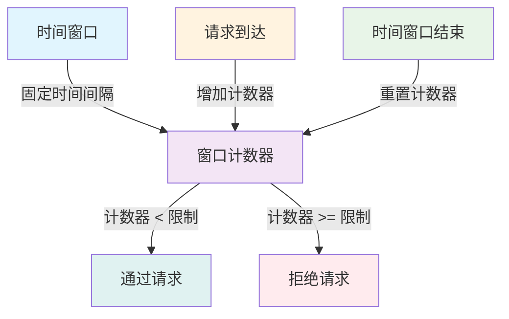

# 限流模块使用指南

## 概述

`jimuqu-common-ratelimit` 模块提供了基于 CacheService 的统一限流功能，支持多种限流算法，用户可以通过配置 CacheService 来自由选择本地缓存、Redis 或其他缓存实现。

## 功能特性

- **多种限流算法**: 令牌桶、滑动窗口、固定窗口
- **统一缓存接口**: 基于 CacheService，支持本地缓存、Redis 等
- **注解支持**: 通过 `@RateLimit` 注解实现方法级限流
- **灵活配置**: 支持配置文件和注解两种配置方式
- **多种维度限流**: 支持基于 IP、用户、方法等多维度限流

## 快速开始

### 1. 添加依赖

```xml
<dependency>
    <groupId>com.jimuqu</groupId>
    <artifactId>jimuqu-common-ratelimit</artifactId>
</dependency>
```

### 2. 基础配置

在 `app.yml` 中添加限流配置：

```yaml
jimuqu:
  ratelimit:
    # 是否启用限流
    enabled: true
    # 以下为默认限流配置，注解未指定则使用默认配置
    # 限流类型：IP-IP限流，USER-用户限流，GLOBAL-全局限流
    type: IP
    # 每秒生成令牌数
    permitsPerSecond: 10.0
    # 最大突发请求数
    maxBurst: 100
    # 限流时间窗口（秒）
    window: 60
    # 限流算法：TOKEN_BUCKET, SLIDING_WINDOW, FIXED_WINDOW
    algorithm: TOKEN_BUCKET
    # 限流键前缀
    keyPrefix: "rate_limit:"
    # 限流失败时的错误消息
    errorMessage: "请求过于频繁，请稍后再试"
```

### 3. 缓存配置

#### 本地缓存配置：
```yaml
jimuqu.cache:
  driverType: "local"  # 缓存类型
  keyHeader: "jimuqu"
```

#### Redis 缓存配置：
```yaml
jimuqu.cache:
  driverType: "redis"  # 驱动类型
  server: "localhost:6379"
  db: 0  # 默认为 0，可不配置
  password: jimuqu
```

## 使用方式

### 1. 注解方式（推荐）

在需要限流的方法上添加 `@RateLimit` 注解：

```java
import com.jimuqu.common.ratelimit.annotation.RateLimit;
import com.jimuqu.common.ratelimit.enums.RateLimitType;
import com.jimuqu.common.ratelimit.enums.RateLimitAlgorithm;

@RestController
public class TestController {

    // IP限流（默认）：每个IP每秒10次请求
    @RateLimit(permitsPerSecond = 10)
    @GetMapping("/ip-test")
    public String ipTest() {
        return "ip rate limit test";
    }

    // 用户限流：每个用户每秒5次请求
    @RateLimit(type = RateLimitType.USER, permitsPerSecond = 5)
    @GetMapping("/user-test")
    public String userTest() {
        return "user rate limit test";
    }

    // 全局限流：所有用户总共每秒20次请求
    @RateLimit(type = RateLimitType.GLOBAL, permitsPerSecond = 20)
    @GetMapping("/global-test")
    public String globalTest() {
        return "global rate limit test";
    }

    // 自定义全局限流键
    @RateLimit(type = RateLimitType.GLOBAL, key = "custom_global_key", permitsPerSecond = 15)
    @GetMapping("/custom-global")
    public String customGlobal() {
        return "custom global rate limit test";
    }

    // 使用滑动窗口算法的IP限流
    @RateLimit(type = RateLimitType.IP, algorithm = RateLimitAlgorithm.SLIDING_WINDOW, permitsPerSecond = 8, maxBurst = 20)
    @GetMapping("/sliding-window")
    public String slidingWindow() {
        return "sliding window rate limit test";
    }

    // 使用固定窗口算法的用户限流
    @RateLimit(type = RateLimitType.USER, algorithm = RateLimitAlgorithm.FIXED_WINDOW, permitsPerSecond = 3, window = 60)
    @GetMapping("/fixed-window")
    public String fixedWindow() {
        return "fixed window rate limit test";
    }
}
```

### 2. 手动调用方式

```java
import com.jimuqu.common.ratelimit.core.RateLimiter;
import com.jimuqu.common.ratelimit.exception.RateLimitException;

@Service
public class TestService {

    @Inject
    private RateLimiter rateLimiter;

    public void businessMethod() {
        // 尝试获取令牌
        boolean acquired = rateLimiter.tryAcquire("business_key", 1);

        if (!acquired) {
            throw new RateLimitException("请求过于频繁，请稍后再试");
        }

        // 执行业务逻辑
        // ...
    }
}
```

## 注解参数说明

| 参数 | 类型 | 默认值 | 说明 |
|------|------|--------|------|
| key | String | "" | 限流键，当 dimension 为 GLOBAL 时使用 |
| type | RateLimitType | IP | 限流类型：IP-IP 限流，USER-用户限流，GLOBAL-全局限流 |
| permitsPerSecond | double | 10.0 | 每秒生成令牌数 |
| maxBurst | int | 100 | 最大突发请求数 |
| window | long | 60 | 限流时间窗口（秒） |
| algorithm | RateLimitAlgorithm | TOKEN_BUCKET | 限流算法 |
| enabled | boolean | true | 是否启用限流 |
| message | String | "" | 自定义错误消息 |

## 限流算法对比

### 1. 令牌桶算法（TOKEN_BUCKET）



**优点**：
- 允许突发流量，流量整形效果好
- 平滑处理突发请求
- 系统负载稳定

**缺点**：
- 实现相对复杂
- 需要维护令牌桶状态

**适用场景**：
- 需要处理突发请求的场景
- 对流量整形要求高的场景
- API 接口限流

### 2. 滑动窗口算法（SLIDING_WINDOW）



**优点**：
- 限流更精确，避免固定窗口的临界问题
- 流量控制更加平滑
- 适合高精度限流

**缺点**：
- 内存占用较大
- 实现相对复杂

**适用场景**：
- 对限流精度要求高的场景
- 付费 API 调用限制
- 精确的流量控制

### 3. 固定窗口算法（FIXED_WINDOW）



**优点**：
- 实现简单，性能好
- 内存占用小
- 易于理解和维护

**缺点**：
- 存在窗口临界问题
- 流量控制不够平滑

**适用场景**：
- 对限流精度要求不高的场景
- 简单的访问控制
- 性能要求高的场景

## 限流维度

### 1. IP 限流（默认）

- **限流键格式**：`ip:{client_ip}`
- **适用场景**：防止恶意 IP 频繁请求，如登录接口、短信验证码接口
- **示例**：每个 IP 每分钟最多 5 次登录尝试
- **优势**：有效防止 DDoS 攻击和恶意爬虫

### 2. 用户限流

- **限流键格式**：`user:{user_id}` 或 `user:anonymous`（未登录用户）
- **适用场景**：基于用户的操作频率控制，如发帖、评论、下单
- **示例**：每个用户每分钟最多发布 3 条评论
- **优势**：精细化控制用户行为，防止刷单

### 3. 全局限流

- **限流键格式**：`{class_name}:{method_name}` 或自定义 key
- **适用场景**：接口整体频率控制，如 API 调用限制、保护服务稳定性
- **示例**：某个接口每秒最多处理 100 个请求
- **优势**：保护服务不被打满，保证系统稳定性

## 缓存配置详解

### 缓存类型选择

#### 1. 单机应用
```yaml
# 推荐使用本地缓存
jimuqu.cache:
  driverType: "local"
  keyHeader: "jimuqu"
```

**优势**：
- 性能高，无网络开销
- 部署简单，无需外部依赖
- 适合单机应用和开发环境

#### 2. 分布式应用
```yaml
# 推荐使用 Redis 缓存
jimuqu.cache:
  driverType: "redis"  # 驱动类型
  server: "localhost:6379"
  db: 0  # 默认为 0，可不配置
  password: jimuqu
```

**优势**：
- 支持分布式部署
- 数据持久化
- 适合生产环境

### 缓存键管理

限流器会自动在缓存键前添加前缀，格式为：
```
{keyHeader}:{keyPrefix}:{限流键}
```

例如：
- IP 限流键：`jimuqu:rate_limit:ip:192.168.1.100`
- 用户限流键：`jimuqu:rate_limit:user:12345`
- 全局限流键：`jimuqu:rate_limit:global:com.example.controller.TestController:testMethod`

## 异常处理

当请求被限流时，会抛出 `RateLimitException` 异常。建议在全局异常处理器中处理：

```java
@RestControllerAdvice
public class GlobalExceptionHandler {

    @ExceptionHandler(RateLimitException.class)
    public R<Void> handleRateLimitException(RateLimitException e) {
        log.warn("请求被限流: {}", e.getMessage());
        return R.fail(e.getMessage());
    }

    @ExceptionHandler(Exception.class)
    public R<Void> handleException(Exception e) {
        log.error("系统异常: {}", e.getMessage());
        return R.fail("系统异常，请稍后重试");
    }
}
```

## 实际应用场景

### 1. 登录接口限流

```java
@PostMapping("/login")
@RateLimit(type = RateLimitType.IP, permitsPerSecond = 5, message = "登录过于频繁，请稍后再试")
public R<LoginVo> login(@RequestBody LoginBody loginBody) {
    // 登录逻辑
    return R.success(loginService.login(loginBody));
}
```

### 2. 短信验证码限流

```java
@PostMapping("/send-sms")
@RateLimit(type = RateLimitType.IP, permitsPerSecond = 1, message = "发送验证码过于频繁")
public R<Void> sendSms(@RequestParam String phone) {
    // 发送验证码逻辑
    return R.success();
}
```

### 3. 评论功能限流

```java
@PostMapping("/comment")
@RateLimit(type = RateLimitType.USER, permitsPerSecond = 2, message = "评论过于频繁，请稍后再试")
public R<Void> addComment(@RequestBody Comment comment) {
    // 添加评论逻辑
    return R.success();
}
```

### 4. API 接口限流

```java
@GetMapping("/api/data")
@RateLimit(type = RateLimitType.GLOBAL, permitsPerSecond = 100, message = "API 调用过于频繁")
public R<List<Data>> getData(@RequestParam DataQuery query) {
    // 数据查询逻辑
    return R.success(dataService.getData(query));
}
```

## 并发安全性

由于 CacheService 不支持 Lua 脚本，当前实现采用了以下策略保证并发安全：

### 1. 令牌桶算法
- **CAS 乐观锁机制**：通过版本号和重试策略避免竞态条件
- **重试次数**：最多重试 3 次，超过次数默认拒绝请求
- **数据结构**：使用带版本号的 TokenBucket 对象

### 2. 滑动窗口算法
- **时间分片**：将窗口分为多个时间分片，减少并发冲突
- **分片计数**：每个时间分片独立计数，避免全局竞争

### 3. 固定窗口算法
- **原子更新**：通过重试机制确保计数的原子性
- **窗口隔离**：不同时间窗口使用不同的键，避免冲突

## 性能建议

### 1. 缓存选择
- **单机应用**：使用本地缓存，性能更高
- **分布式系统**：使用 Redis，保证数据一致性

### 2. 算法选择
- **令牌桶算法**：推荐使用，平衡了性能和效果，支持突发流量
- **滑动窗口算法**：限流更精确，避免临界问题
- **固定窗口算法**：实现简单，性能最好

### 3. 配置优化
- **限流键设计**：避免使用过长的键名，影响性能
- **并发处理**：当前实现使用 CAS 乐观锁和重试机制保证原子性
- **缓存预热**：重要接口的限流数据可以预热

## 架构优势

1. **统一接口**：使用 CacheService 统一缓存接口，支持多种缓存实现
2. **配置灵活**：通过配置文件即可切换不同的缓存实现
3. **代码简洁**：精简架构，移除了多余的包装层
4. **扩展性强**：新增缓存实现时，限流器无需修改
5. **性能优化**：使用 CAS 乐观锁和时间分片提高并发性能
6. **兼容性好**：不依赖 Lua 脚本，适配更多缓存实现

## 注意事项

1. **异常处理**：限流器异常时会默认放行，确保业务可用性
2. **缓存依赖**：限流器依赖于 CacheService 的实现，请确保缓存服务正常运行
3. **用户认证**：用户限流需要配置相应的用户认证系统
4. **配置生效**：限流配置的变更需要重启应用才能生效
5. **性能考虑**：不同缓存实现的性能和特性可能不同，请根据实际需求选择
6. **高并发场景**：高并发场景下建议使用 Redis 缓存，本地缓存可能存在性能瓶颈

## 版本历史

- **v1.0.0**: 基础限流功能
- **v1.1.0**: 支持多种限流算法
- **v1.2.0**: 优化并发性能和稳定性
- **v1.3.0**: 支持自定义缓存实现

---

*该指南基于 jimuqu-common-ratelimit 模块的实际使用经验整理，如有更新请参考最新代码。*